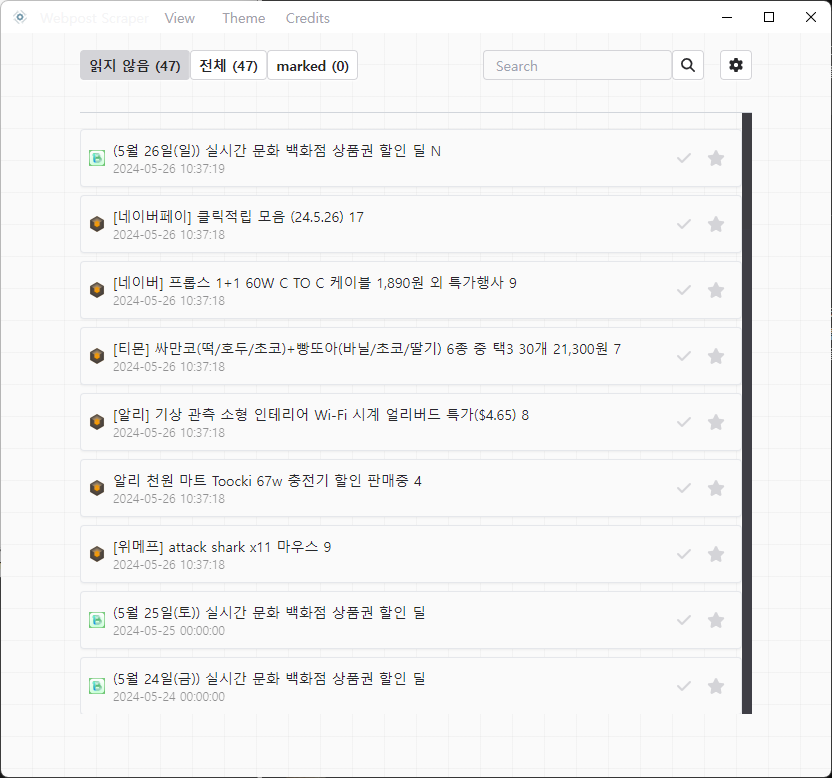
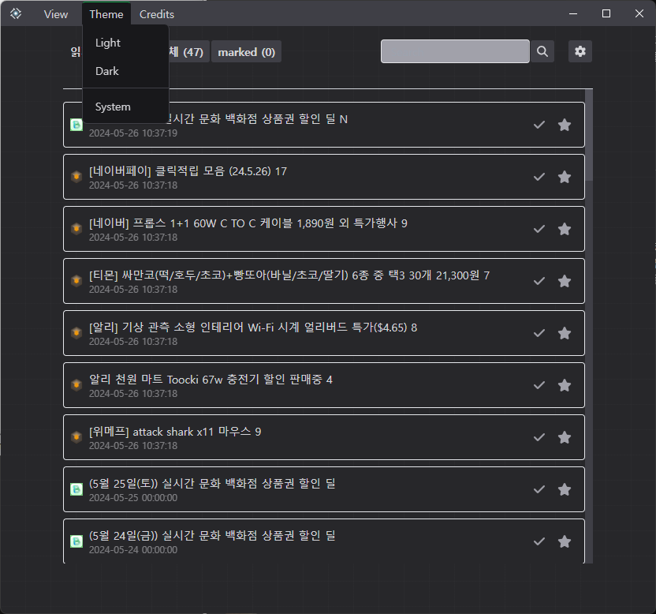
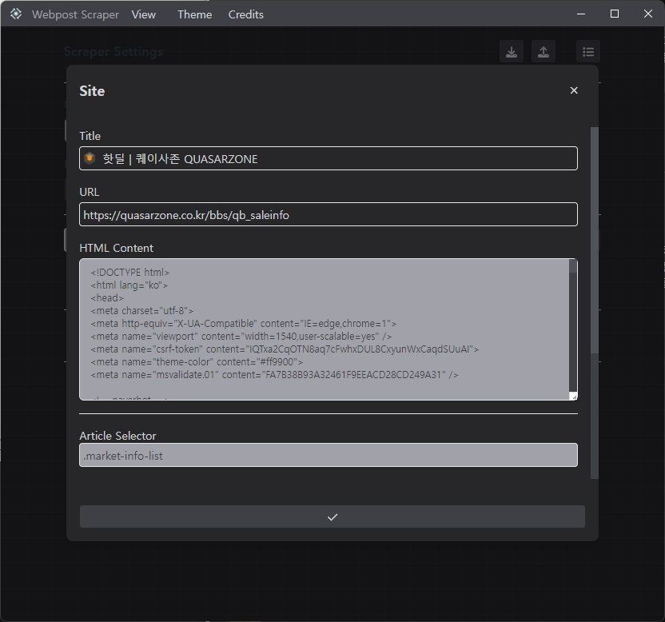

# Webpost Scraper

Webpost Scraper is a Windows-based Electron application designed to collect posts from websites. The primary goal of this project is to develop an Electron application for Windows that can efficiently scrape and collect posts from various websites. This application was inspired by [wepplication tools scrapper](https://wepplication.github.io/tools/scrapper/).

<div style="display: flex; justify-content: space-between;">
  
  
  
</div>

## Getting Started

To get started with Webpost Scraper, follow these steps:

### Prerequisites

- Node.js
- pnpm (Package manager)

### Installation

Install the dependencies using pnpm:

```bash
pnpm install
```

### Running the Application

To start the application, use the following command:

```bash
pnpm start
```

### Running the Application on Windows x64

For Windows x64 environments, you can also run the program using the setup file available in the releases section of the GitHub repository. Download the setup file from [here](https://github.com/tinywind/webpost-scraper/releases) and follow the installation instructions.

## Main Features

- **Post Scraping:** Automatically scrape and collect posts from specified websites.
- **Custom Shortcuts:** Support for custom keyboard shortcuts to enhance user experience.
- **Dark Mode:** Utilize `prefers-color-scheme` to enable dark mode.
- **Notification System:** Built-in notifications to alert users of key events or updates.
- **Redux Integration:** State management using Redux to handle application state efficiently.
- **React Router:** Use of `react-router-dom` for routing and navigation within the application.
- **Responsive Design:** Layout adjustments to support different screen sizes and resolutions.
- **Database Integration:** Use of `nedb` (main thread) for persistent storage.

## Frameworks and Libraries

- **Electron:** The main framework for building the cross-platform desktop application.
- **React:** For building the user interface.
- **Redux:** For state management.
- **React Router:** For handling routing within the application.
- **Tailwind CSS:** For styling the application.
- **nedb:** For lightweight database operations in the main process.

## License

This project is licensed under the MIT License.

## Acknowledgements

This project was created using the [electron-react-webpack-typescript-2024](https://github.com/codesbiome/electron-react-webpack-typescript-2024) template. See the [LICENSE](https://raw.githubusercontent.com/codesbiome/electron-react-webpack-typescript-2024/master/LICENSE) file for details.

## Favicon Copyright Notice

The favicon for this project is used under license from https://www.flaticon.com/. By using the favicon, we agree to the terms outlined at "https://www.freepikcompany.com/legal/#nav-flaticon".
